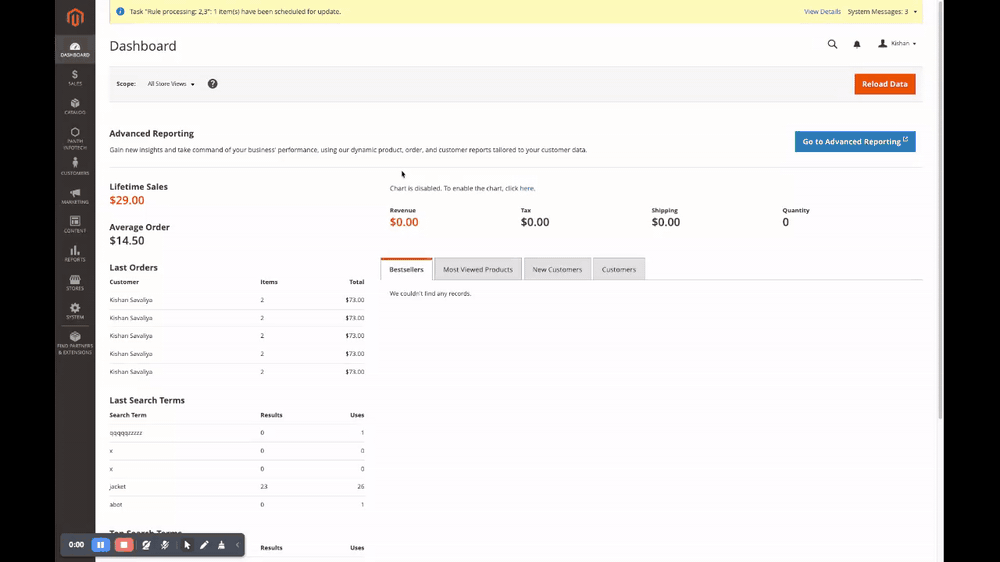
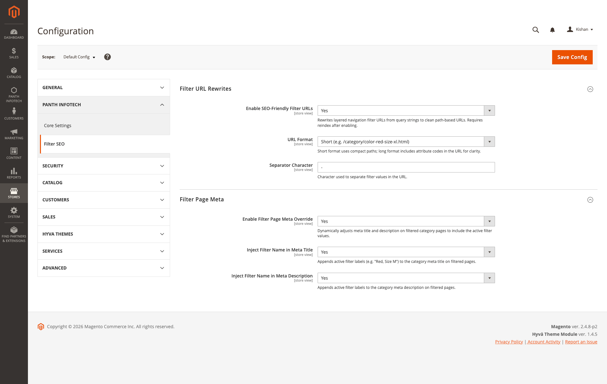
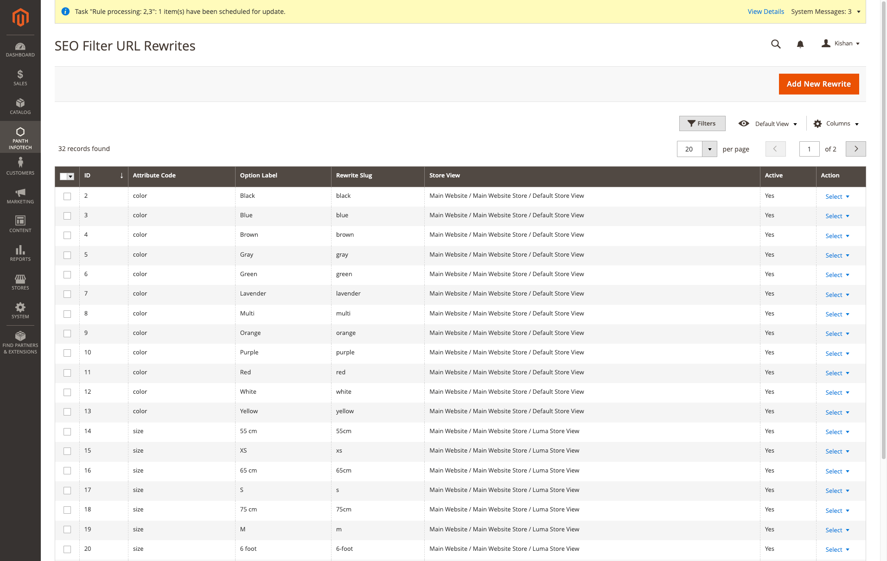
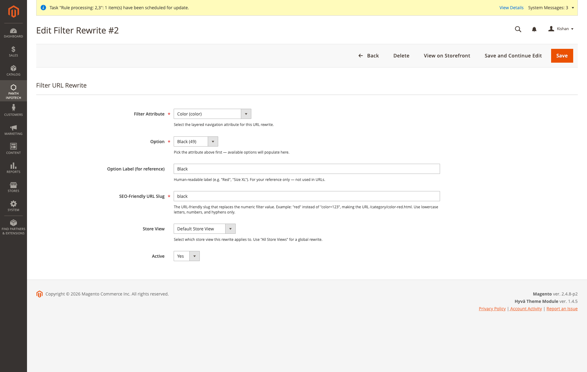
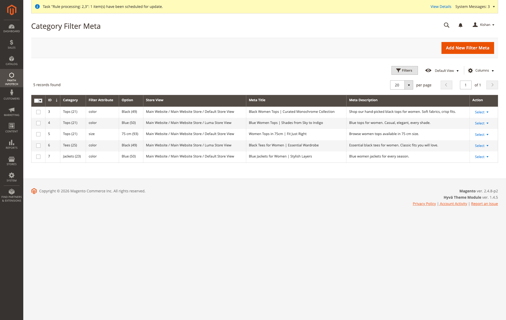
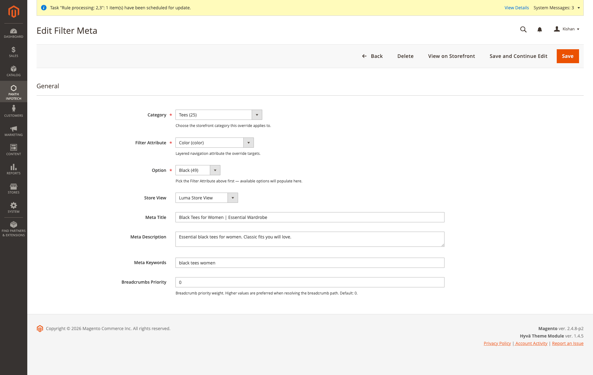

<!-- SEO Meta -->
<!--
  Title: Panth Filter SEO — Clean Layered-Navigation URLs + Dynamic Filter Meta for Magento 2 (Hyva + Luma)
  Description: Rewrites layered navigation filter URLs from /category?color=49&size=166 into clean path-based URLs like /category/color-red-size-xl.html. Per-category, per-store meta title / description / keywords overrides for every filter combination. Works on Hyva and Luma with no template overrides.
  Keywords: magento 2 filter url rewrite, layered navigation seo, magento filter slug, magento category filter meta, hyva filter seo, luma filter seo, seo friendly filter urls magento, magento layered nav clean urls
  Author: Kishan Savaliya (Panth Infotech)
-->

# Panth Filter SEO — Clean Layered-Navigation URLs + Per-Filter Meta for Magento 2 (Hyva + Luma)

[](https://magento.com)
[](https://php.net)
[]()
[](https://packagist.org/packages/mage2kishan/module-filter-seo)
[](https://hyva.io)
[]()
[](https://www.upwork.com/freelancers/~016dd1767321100e21)
[](https://www.upwork.com/agencies/1881421506131960778/)
[](https://kishansavaliya.com)
[](https://kishansavaliya.com/get-quote)

<p align="center">
  
</p>

> **Layered navigation SEO done right.** Turns `/women/tops.html?color=49&size=166` into `/women/tops/color-red-size-xl.html` — a real crawlable URL that Google indexes as its own page. Pair it with **per-category, per-store, per-filter** meta title / description / keywords so every filter combination is a bespoke landing page, not a duplicate-content liability.

Magento ships layered navigation as query-string filters — Google treats `?color=49` and `?color=50` as the same URL and drops them from the index. This module rewrites filter URLs into clean path segments (`/color-red.html`) and lets you override the `<title>` and `<meta description>` of each filtered page from the admin. It's the same pattern every major fashion/electronics retailer uses — now on Magento, theme-agnostic.

---

## Demo



*Admin flow: browse the rewrite grid, open a record to tweak the slug / store scope, jump straight to the storefront with **View on Storefront** (opens in a new tab with the live filtered URL), and repeat for per-category meta overrides.*

---

## Preview

### Admin Configuration



*All six toggles at **Stores → Configuration → Panth Infotech → Filter SEO** — master switch for clean URLs, `short` vs `long` URL format, separator character, master switch for filter meta overrides, and whether to auto-append active filter labels to the category title / description when no explicit override exists.*

---

### SEO Filter URL Rewrites

<table>
<tr>
<td width="55%" align="center"><b>Rewrite grid — per-attribute, per-option, per-store</b></td>
<td width="45%" align="center"><b>Edit form — slug + store scope</b></td>
</tr>
<tr>
<td><a href="docs/admin-rewrite-grid.png"></a></td>
<td><a href="docs/admin-rewrite-edit.png"></a></td>
</tr>
</table>

*The `color=49` numeric option becomes the `black` URL slug — the rewrite is what produces `/women/tops/color-black.html` instead of `/women/tops.html?color=49`. Rewrites are scoped per store, so the same option can map to localized slugs on different store views. **View on Storefront** in the action column opens the live filtered URL in a new tab.*

---

### Category Filter Meta

<table>
<tr>
<td width="55%" align="center"><b>Meta grid — per-category, per-option, per-store</b></td>
<td width="45%" align="center"><b>Edit form — meta title, description, keywords</b></td>
</tr>
<tr>
<td><a href="docs/admin-meta-grid.png"></a></td>
<td><a href="docs/admin-meta-edit.png"></a></td>
</tr>
</table>

*Override `<title>`, `<meta description>`, `<meta keywords>` and breadcrumb priority for every `{category} × {filter option} × {store view}` combination. "Black Women Tops | Curated Monochrome Collection" is stored against `Tops × color:Black × Default Store`, so the filtered page gets its own bespoke meta instead of inheriting a generic "Tops" title.*

---

## Need Custom Magento 2 Development?

<p align="center">
  <a href="https://kishansavaliya.com/get-quote">
    
  </a>
</p>

<table>
<tr>
<td width="50%" align="center">

### Kishan Savaliya
**Top Rated Plus on Upwork**

[](https://www.upwork.com/freelancers/~016dd1767321100e21)

</td>
<td width="50%" align="center">

### Panth Infotech Agency

[](https://www.upwork.com/agencies/1881421506131960778/)

</td>
</tr>
</table>

---

## Table of Contents

- [Features](#features)
- [How the URL Rewrite Works](#how-the-url-rewrite-works)
- [Compatibility](#compatibility)
- [Installation](#installation)
- [Admin Configuration](#admin-configuration)
- [Managing Filter Rewrites](#managing-filter-rewrites)
- [Managing Filter Meta Overrides](#managing-filter-meta-overrides)
- [Multi-Store Behaviour](#multi-store-behaviour)
- [Troubleshooting](#troubleshooting)
- [Support](#support)

---

## Features

- **Clean filter URLs** — `/women/tops/color-red-size-xl.html` instead of `/women/tops.html?color=49&size=166`. One crawlable URL per filter combination, indexable by Google.
- **Two URL formats** — short (`/color-red-size-xl.html`) or long (`/color/red/size/xl.html`). Separator character is admin-configurable.
- **Per-option rewrite slugs** — define the slug for every attribute option once. `color=49` → `black`, `size=166` → `xs`. Store-scoped: the same option can map to `black` on the EN store and `schwarz` on the DE store.
- **Auto-slug for new attribute options** — when an admin adds a new swatch / dropdown option, the module observes the save event and inserts a slug row automatically. No manual backfill.
- **Per-filter meta overrides** — `{category} × {attribute:option} × {store}` overrides for `<title>`, `<meta description>`, `<meta keywords>` and breadcrumb priority. "Black Tees for Women" instead of inheriting the plain "Tees" title.
- **Auto-appended filter labels** — when no explicit override exists, optionally append active filter names ("Color: Red, Size: XL") to the category title / meta description.
- **View on Storefront** — every grid row and every edit form has a **View on Storefront** action that opens the live filtered URL on the correct store (hyva.test / luma.test / whatever) in a new tab. Resolves a valid category even if the rewrite isn't pinned to one.
- **Multi-store aware** — rewrites and meta overrides respect `store_id`, with `store_id=0` (All Store Views) as a global default and per-store rows overriding it.
- **Theme-agnostic** — no frontend template overrides. Works identically on Hyva and Luma because the rewrite happens at the router + URL-builder layer, below the theme.
- **Falls back gracefully** — if a slug is missing for a store, the module silently falls back to the native `?color=49` query-string URL so nothing breaks.

---

## How the URL Rewrite Works

```
Customer clicks:       /women/tops/color-red-size-xl.html
Router parses:         category = "/women/tops", filter segment = "color-red-size-xl"
Reverse-lookup slugs:  "red" → color=49,  "xl" → size=170
Layered nav loads:     /women/tops.html with color=49 + size=170 applied
Storefront renders:    /women/tops/color-red-size-xl.html (customer-facing URL stays clean)
```

No redirects, no rewrite rules in `.htaccess`. The module adds:

- a **URL parser** (`Model/FilterUrl/UrlParser.php`) that extracts the filter segment from the request path,
- a **URL builder** (`Model/FilterUrl/UrlBuilder.php`) that injects the filter segment into outbound category links in the layered navigation,
- a **router plugin** that routes the filter segment to the underlying Magento category controller without a visible redirect.

Reverse lookups are memoised per request via `RewriteRepository` so the router cost is one SELECT per unique store during the lifetime of a request.

---

## Compatibility

| Requirement | Supported |
|---|---|
| Magento Open Source | 2.4.4, 2.4.5, 2.4.6, 2.4.7, 2.4.8 |
| Adobe Commerce | 2.4.4 — 2.4.8 |
| PHP | 8.1, 8.2, 8.3, 8.4 |
| Hyva Theme | 1.0+ (theme-agnostic — nothing is rendered directly) |
| Luma Theme | Native support |
| Panth Core | ^1.0 (installed automatically) |

---

## Installation

```bash
composer require mage2kishan/module-filter-seo
bin/magento module:enable Panth_Core Panth_FilterSeo
bin/magento setup:upgrade
bin/magento setup:di:compile
bin/magento cache:flush
```

### Verify

```bash
bin/magento module:status Panth_FilterSeo
# Module is enabled
```

Then navigate to **Panth Infotech → SEO Filter URL Rewrites** in the admin sidebar.

---

## Admin Configuration

**Stores → Configuration → Panth Infotech → Filter SEO.** The section splits into two groups — URL rewriting and meta overrides — so you can adopt one without the other.

| Group | Setting | Default | Purpose |
|---|---|---|---|
| Filter URL Rewrites | Enable SEO-Friendly Filter URLs | No | Master switch. When Yes, layered navigation builds `/color-red.html` links; when No, native `?color=49` is used. |
| Filter URL Rewrites | URL Format | Short | `short` = `/color-red-size-xl.html`, `long` = `/color/red/size/xl.html`. |
| Filter URL Rewrites | Separator Character | `-` | The char between attribute and slug in short format. |
| Filter Page Meta | Enable Filter Page Meta Override | No | Master switch for the meta grid. When Yes, stored overrides are applied on filtered category pages. |
| Filter Page Meta | Inject Filter Name in Meta Title | No | When no override exists, append "Color: Red, Size: XL" to the category title. |
| Filter Page Meta | Inject Filter Name in Meta Description | No | Same as above for `<meta description>`. |

Every setting is scope-aware (website / store view) so multi-store catalogs can opt in per store.

---

## Managing Filter Rewrites

**Panth Infotech → SEO Filter URL Rewrites** lists one row per `{attribute, option, store}`. The module seeds rows for every filterable attribute option automatically on first install, and the attribute-option observer keeps them in sync as admins add new swatches. You only edit the **SEO-Friendly URL Slug** column.

Slug rules enforced client- and server-side:

- Lowercase letters, digits, and hyphens only.
- Must be unique per `(attribute, store)` pair.
- Reindex / cache flush isn't needed — the slug takes effect on the next request.

The **View on Storefront** row action opens the live filtered URL in a new tab on the correct store so you can verify the rewrite instantly.

---

## Managing Filter Meta Overrides

**Panth Infotech → Category Filter Meta** is where you upgrade filtered category pages from "duplicate content" to "bespoke landing page". Pick a category + filter attribute + option + store, then set:

- **Meta Title** — e.g. `Black Women Tops | Curated Monochrome Collection`.
- **Meta Description** — 150-160 chars for the SERP snippet.
- **Meta Keywords** — optional, kept for legacy SEO plugins.
- **Breadcrumbs Priority** — when multiple filter overrides match, the higher priority wins; default 0.

No override is required — categories without an override behave as before. This is purely opt-in on a per-combination basis, so you can start with your top-converting filter pages and expand from there.

---

## Multi-Store Behaviour

- **Rewrites and meta overrides are store-scoped.** A row with `store_id = 0` (All Store Views) is a global default; a row with `store_id = 2` (Luma) overrides that default for store 2.
- **View on Storefront always resolves to the correct domain.** If a Filter Meta record is pinned to the Luma store, the View link opens `https://luma.test/...`; for Default store it opens `https://hyva.test/...`. URL rewrites are looked up per store via `UrlFinderInterface`, and the module refuses to build a URL pointing at a category outside the target store's root-category tree.
- **Slug fallback.** If a Filter Meta record is defined for a store but no matching rewrite slug exists for that store, the View URL falls back to the native `?color=49` query-string form — the filter still applies on the storefront, it just isn't "clean" until the slug is defined.

---

## Troubleshooting

### Clean URLs still show `?color=49`

Three things to check, in order:
1. **Master switch** — *Stores → Configuration → Panth Infotech → Filter SEO → Enable SEO-Friendly Filter URLs = Yes*, then flush config cache.
2. **Rewrite slug exists for that store** — open the rewrite grid, filter to the store view you're browsing, confirm a slug is set.
3. **URL rewrite indexer** — Magento's `catalog_url_rewrite_product` indexer is independent, but if category URLs themselves are broken, the filter segment has nothing to attach to. Run `bin/magento indexer:reindex catalog_url_rewrite_category`.

### `404` on a filtered URL that should match

The router looks up category slugs first, then the filter segment. A mismatched URL suffix (`.html` vs no suffix) is the usual culprit. Check *Stores → Configuration → Catalog → Catalog → Search Engine Optimization → Product URL Suffix / Category URL Suffix* and make sure they match the one in the filter URL you're testing.

### View on Storefront button doesn't appear in the grid

The button hides when the module can't resolve any valid category for the row (no Filter Meta record, no products with that attribute option in any non-root category, and no storefront-visible categories under the target store's root). Add a product with the option or a Filter Meta record, then refresh.

### Meta overrides don't show on the rendered page

Ensure *Enable Filter Page Meta Override = Yes* for the store view, and flush `full_page` cache. The injector fires from `\Panth\FilterSeo\Model\FilterMeta\MetaInjector::inject()` via a `catalog_controller_category_init_after` observer — if a third-party module short-circuits that event (rare), the injector is skipped.

---

## Support

- **Issues:** [github.com/mage2sk/module-filter-seo/issues](https://github.com/mage2sk/module-filter-seo/issues)
- **Agency:** [Panth Infotech on Upwork](https://www.upwork.com/agencies/1881421506131960778/)
- **Direct:** [kishansavaliya.com](https://kishansavaliya.com) — [Get a free quote](https://kishansavaliya.com/get-quote)
