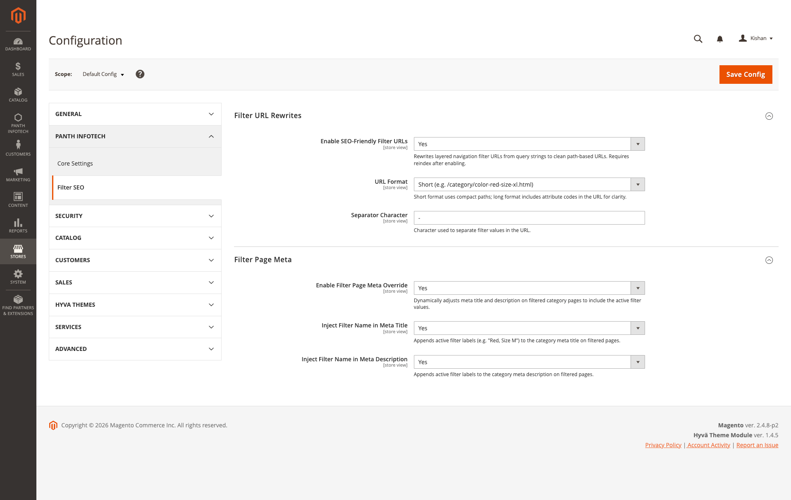
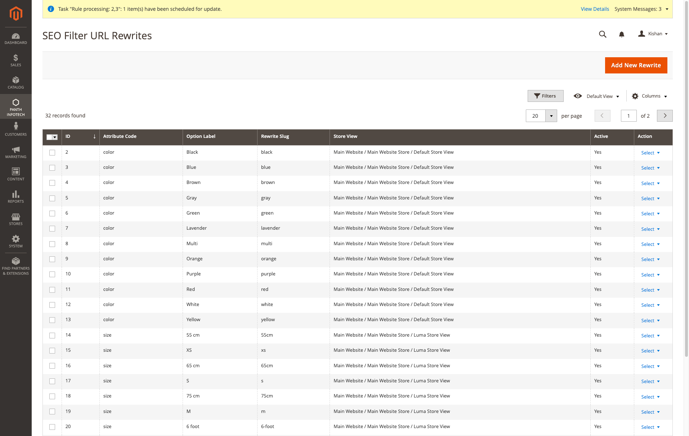
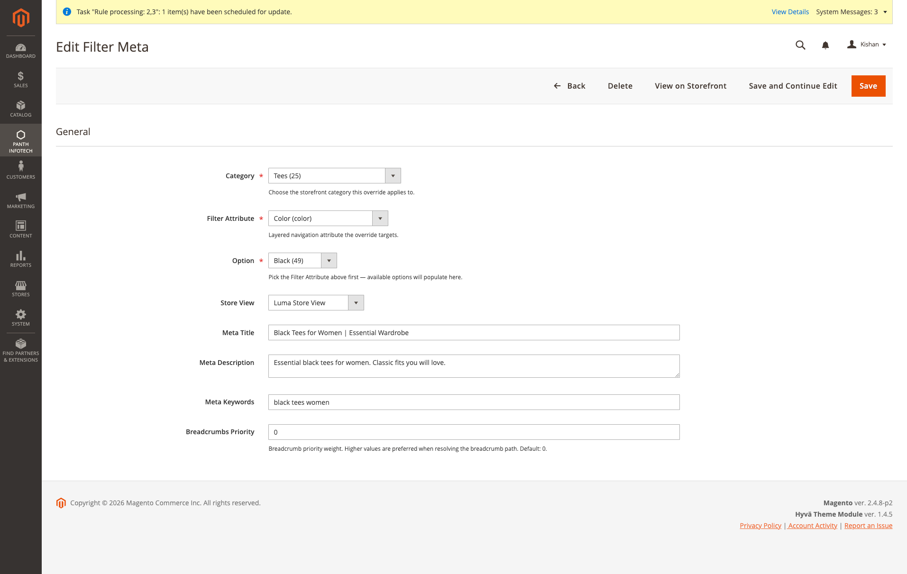

# Magento 2 Filter SEO

Panth Filter SEO changes how Magento 2 layered navigation appears to search engines. It rewrites filter links from query strings such as `/women/tops.html?color=49&size=166` to path-based URLs such as `/women/tops/color-red-size-xl.html`, resolves those paths back to the normal category controller with a custom router, and 301-redirects the old query-string form to the path form. On filtered category pages it can replace the meta title, meta description and meta keywords with values stored per category, attribute option and store view, append the active filter labels to the default title and description, and emit `noindex,follow` when two or more facets are active.

It is intended for store owners and SEO teams who want filtered category pages to have stable, readable URLs and their own meta data, and for developers who need this handled below the theme layer. The module contains no theme-specific files: it works through plugins on Magento core classes and a frontend router, and the product page lists Hyva and Luma as supported themes.

Product page: [kishansavaliya.com/magento-2-filter-seo.html](https://kishansavaliya.com/magento-2-filter-seo.html)



## Features

- Path-based filter URLs built from per-option slugs, in a short format (`/category/color-red-size-xl.html`) or a long format (`/category/color/red/size/xl.html`), with a configurable separator character for the short format.
- Frontend router (`Panth\FilterSeo\Controller\Router\FilterRouter`, sort order 40) that resolves a path-based filter URL to `catalog/category/view` with the filter parameters set, without a redirect.
- 301 redirect from query-string filter URLs to the path-based URL on category pages, keeping `p`, `product_list_limit`, `product_list_order`, `product_list_dir` and `product_list_mode` as query parameters.
- Plugins that rewrite filter item links, filter removal links, swatch links, the "Clear All" link and pager links so that they keep the path-based form.
- Per-option URL slugs stored in `panth_seo_filter_rewrite`, scoped per store view with a store 0 (all store views) fallback, managed in an admin grid and edit form.
- Automatic slug rows (store 0, lowercased label with non-alphanumeric characters replaced by `-`) for every option of a select or multiselect product attribute when that attribute is saved.
- Per category, attribute option and store view overrides of meta title, meta description and meta keywords stored in `panth_seo_category_filter_meta`, managed in an admin grid and edit form.
- Optional appending of active filter labels (for example `Color: Red, Size: XL`) to the category meta title and meta description when no stored override applies.
- `noindex,follow` robots meta on category pages with a configurable minimum number of active facets (default 2).
- "View on Storefront" action on both grids and both edit forms that opens the resolved filtered URL for the record's store view.
- Keyword search on both grids (attribute code, option label, rewrite slug; attribute code, meta title, meta keywords).
- Data patch that migrates configuration values saved under the older `panth_seo/filter_urls/*` and `panth_seo/filter_meta/*` paths to `panth_filter_seo/*`.

## Compatibility

| Platform | Versions |
|---|---|
| Magento Open Source | 2.4.4 to 2.4.8 (as published on the product page) |
| Adobe Commerce | 2.4.4 to 2.4.8 (as published on the product page) |
| PHP | 8.1, 8.2, 8.3, 8.4 (`~8.1.0||~8.2.0||~8.3.0||~8.4.0` in `composer.json`) |
| Themes | Hyva and Luma (product page); no theme-specific code in the module |

Composer constraints on Magento packages: `magento/framework` ^103.0, `magento/module-store` ^101.1, `magento/module-catalog` ^104.0, `magento/module-eav` ^102.1, `magento/module-catalog-search` ^102.0, `magento/module-layered-navigation` ^100.4, `magento/module-swatches` ^100.4, `magento/module-url-rewrite` ^102.0, `magento/module-backend` ^102.0, `magento/module-ui` ^101.2, `magento/module-config` ^101.2.

## Requirements

- Magento Open Source or Adobe Commerce 2.4.4 to 2.4.8.
- PHP 8.1, 8.2, 8.3 or 8.4.
- `mage2kishan/module-core` ^1.0 (module `Panth_Core`), installed automatically by Composer. It provides the "Panth Extensions" admin menu parent that this module's menu items attach to.
- Suggested: `mage2kishan/module-robots-seo` >= 1.0.11, so that the facet `noindex` meta set by this module is preserved rather than reset to the store default.

## Installation

```bash
composer require mage2kishan/module-filter-seo
bin/magento module:enable Panth_Core Panth_FilterSeo
bin/magento setup:upgrade
bin/magento setup:di:compile
bin/magento setup:static-content:deploy -f
bin/magento cache:flush
```

Notes:

- `setup:di:compile` is only needed in production mode.
- `setup:static-content:deploy -f` is needed because the module ships admin JavaScript under `view/adminhtml/web/js` (an option picker for the edit forms and a grid actions mixin).
- The frontend router resolves the category part of a filter URL from Magento's `url_rewrite` table, so category URL rewrites must exist for the store view. The "Enable SEO-Friendly Filter URLs" field notes that a reindex is required after enabling.

Check that the module is enabled:

```bash
bin/magento module:status Panth_FilterSeo
```

## Configuration

Admin path: Stores > Configuration > Panth Infotech > Filter SEO. The section is also reachable from the admin menu under Panth Extensions > Filter SEO > Configuration. All fields can be set at default, website and store view scope.

### Filter URL Rewrites

| Setting | Default | What it does |
|---|---|---|
| Enable SEO-Friendly Filter URLs | No | Turns on the URL builder plugins, the frontend router and the 301 redirect from query-string filter URLs. When No, Magento's native `?attribute=option_id` links are used and the router does nothing. |
| URL Format | Short (e.g. /category/color-red-size-xl.html) | Short joins attribute codes and slugs with the separator in one path segment. Long (e.g. /category/color/red/size/xl.html) uses one path segment for the attribute code and one for the slug. |
| Separator Character | `-` | Character placed between attribute code and slug, and between filter pairs, in the short format. An empty value falls back to `-`. |
| Noindex Facet Combination Pages | Yes | Sets the robots meta to `noindex,follow` on category pages whose number of active facets reaches the minimum below. Works independently of the URL rewrite toggle. |
| Minimum Active Facets Before Noindex | 2 | Number of active facets at which the page becomes noindex. Shown only when the field above is Yes. Values below 1 are treated as 2. |

### Filter Page Meta

| Setting | Default | What it does |
|---|---|---|
| Enable Filter Page Meta Override | No | Turns on the meta injection on filtered category pages: stored overrides from the "Filter Page Meta" grid and, when no override applies, the two options below. |
| Inject Filter Name in Meta Title | Yes | Appends the active filter labels (`Filter Name: Option Label, ...`), separated by a vertical bar, to the page title when no stored meta title override matches. |
| Inject Filter Name in Meta Description | Yes | Appends the active filter labels, separated by a vertical bar, to the meta description (or sets it when the description is empty) when no stored meta description override matches. |

Configuration paths:

- `panth_filter_seo/filter_urls/filter_urls_enabled`
- `panth_filter_seo/filter_urls/url_format`
- `panth_filter_seo/filter_urls/separator`
- `panth_filter_seo/filter_urls/noindex_combinations`
- `panth_filter_seo/filter_urls/noindex_min_facets`
- `panth_filter_seo/filter_meta/filter_meta_enabled`
- `panth_filter_seo/filter_meta/inject_filter_in_title`
- `panth_filter_seo/filter_meta/inject_filter_in_description`

With the defaults, nothing changes on the storefront except the `noindex,follow` robots meta on category pages with two or more active facets.

### Admin pages

Both pages are under Panth Extensions > Filter SEO in the admin menu.

- Filter URL Rewrites (`panth_filterseo/filterrewrite/index`): grid with the columns ID, Attribute Code, Option Label, Rewrite Slug, Store View and Active; row actions Edit, View on Storefront and Delete. The edit form has the fields Filter Attribute, Option, Option Label (for reference), SEO-Friendly URL Slug, Store View and Active. The Option list is loaded for the chosen attribute and suggests a slug derived from the option label.
- Filter Page Meta (`panth_filterseo/filtermeta/index`): grid with the columns ID, Category, Filter Attribute, Option, Store View, Meta Title and Meta Description; row actions Edit, View on Storefront and Delete, and a Delete mass action for the selected rows. The edit form has the fields Category, Filter Attribute, Option, Store View, Meta Title, Meta Description, Meta Keywords and Breadcrumbs Priority. Category and Filter Attribute are required.





## Usage

### URL format

With "Enable SEO-Friendly Filter URLs" set to Yes and slugs `red` (color, option 49) and `xl` (size, option 166) stored for the store view:

| | Short format, separator `-` | Long format |
|---|---|---|
| Before | `/women/tops.html?color=49&size=166` | `/women/tops.html?color=49&size=166` |
| After | `/women/tops/color-red-size-xl.html` | `/women/tops/color/red/size/xl.html` |

Rules coded in `Model/FilterUrl/UrlBuilder` and `Model/FilterUrl/UrlParser`:

- Filter pairs are sorted by attribute code, so the same combination always produces the same path regardless of click order.
- The segment is inserted before the category URL suffix (`.html` when present). Unfiltered category URLs are not changed.
- Only filters that have an active slug for the store view (or for store 0) appear in the path. A filter link whose combination has no slug at all keeps Magento's native query-string URL. When some active filters have slugs and others do not, the ones without a slug (for example a price range) are kept as query parameters on the path-based URL, for example `/women/tops/color-red.html?price=10-20`. Filter removal links keep the remaining filters in the same way.
- In the short format the parser matches the segment against the stored slugs of each attribute, so slugs and attribute codes may contain the separator character. For example `color-dark-blue-size-xl` resolves to the `color` slug `dark-blue` and the `size` slug `xl`. A segment is limited to 32 separator-delimited parts.
- The parser resolves the category by looking up the longest leading part of the path in the `url_rewrite` table (entity type `category`, current store), with and without the `.html` suffix, and treats the remaining segments as filters. Each slug must resolve to a rewrite row for the attribute code in the path; otherwise the router does not match and Magento's normal routing continues. The same slug may be used by different attributes. The category lookup is only done for splits whose filter part matches stored slugs.
- The router skips paths that start with `admin` or `rest/`.

### Slugs and store views

- Slug rows live in `panth_seo_filter_rewrite`, unique per attribute code, option ID and store view. The edit form accepts only letters, numbers, hyphens and underscores in a slug. Saving a second row for the same attribute option and store view is refused with a message; edit the existing row instead. A row with store view "All Store Views" (store 0) applies to every store that has no row of its own; store-specific rows take precedence.
- Saving a select or multiselect product attribute in the admin inserts a store 0 row for every option that does not have one yet, with `is_active` = 1. Existing rows are not changed. Store-specific rows are never created automatically.
- Inactive rows are ignored by both the URL builder and the parser.

### Redirects

When "Enable SEO-Friendly Filter URLs" is Yes and a category page is requested with a filterable attribute in the query string (attributes with "Use in Layered Navigation" set to Filterable with or without results), `Plugin/FilterUrl/CanonicalRedirectPlugin` answers with a 301 redirect to the path-based URL, provided at least one filter in the query string has a slug. Filters already in the path and filters without a slug are kept: the former stay in the path, the latter stay as query parameters. The paging, limit, sort order, sort direction and list mode parameters are carried over as a query string. The redirect target is built from the category URL of the current store. A request is only redirected while a query-string filter with a slug is present, so the target of a redirect is not redirected again.

### Meta title, description and keywords

When "Enable Filter Page Meta Override" is Yes and at least one filter is active on a category page (`Plugin/FilterMeta/CategoryViewPlugin`, `Model/FilterMeta/MetaInjector`):

1. For each active filter the module looks up `panth_seo_category_filter_meta` by category, attribute code, option ID and store view, preferring the row for the current store view over the store 0 row.
2. Non-empty `meta_title`, `meta_description` and `meta_keywords` values from matching rows are applied to the page. When several active filters have rows, each field takes the value from the last matching row processed.
3. If no matching row provides a title and "Inject Filter Name in Meta Title" is Yes, ` | Filter Name: Option Label, ...` is appended to the page title. The same applies to the description with "Inject Filter Name in Meta Description".
4. Labels are taken from the layered navigation state (filter name and option label) when it is available, otherwise from the attribute store label and the option text of the filter value, with HTML tags and control characters stripped. Filters without options, such as price ranges, use the raw value (for example `Price: 30-40`).

The `breadcrumbs_priority` column is stored by the edit form but is not read anywhere else in the module.

### Robots meta

`Plugin/FilterMeta/FacetRobotsPlugin` sets the robots meta to `noindex,follow` when "Noindex Facet Combination Pages" is Yes and the number of active facets on the category page is at least "Minimum Active Facets Before Noindex". The base category page and pages with fewer facets keep the robots value Magento would otherwise output. This runs whether or not the URL rewrite feature is enabled. The module does not add or change canonical link tags.

### Effects on Magento's own URL rewrites

The module does not write to the `url_rewrite` table. It reads category rewrites from it to resolve the category part of a filter path and to build "View on Storefront" links. Filter paths are resolved at request time by the router; no rows are generated for filter combinations.

## Developer Notes

- Module name: `Panth_FilterSeo`; Composer package: `mage2kishan/module-filter-seo`; PSR-4 namespace: `Panth\FilterSeo`.
- `mage2kishan/module-advanced-seo` lists this package as a suggested package in its `composer.json`; it does not require it.
- Frontend router: `Panth\FilterSeo\Controller\Router\FilterRouter`, registered in `etc/frontend/di.xml` with sort order 40 (after the URL rewrite and standard routers, before the CMS and default routers).
- Frontend plugins (`etc/frontend/di.xml`, frontend area only):
  - `Magento\Catalog\Model\Layer\Filter\Item`: `aroundGetUrl` (`Plugin\FilterUrl\FilterItemUrlPlugin`) and `aroundGetRemoveUrl` (`Plugin\FilterUrl\FilterItemRemoveUrlPlugin`).
  - `Magento\Swatches\Block\LayeredNavigation\RenderLayered::buildUrl` (`Plugin\FilterUrl\SwatchUrlPlugin`).
  - `Magento\LayeredNavigation\Block\Navigation\State::getClearUrl` (`Plugin\FilterUrl\ClearAllUrlPlugin`).
  - `Magento\Theme\Block\Html\Pager::getPagerUrl` (`Plugin\FilterUrl\PagerPlugin`).
  - `Magento\Catalog\Controller\Category\View::execute` (`Plugin\FilterUrl\CanonicalRedirectPlugin`, sort order 5).
  - `Magento\Catalog\Block\Category\View::setLayout` (`Plugin\FilterMeta\FacetRobotsPlugin`, sort order 190; `Plugin\FilterMeta\CategoryViewPlugin`, sort order 200).
- Observer: `Panth\FilterSeo\Observer\FilterUrl\AttributeOptionSave` on `catalog_entity_attribute_save_after` (global area).
- Key services: `Model\FilterUrl\UrlBuilder` (`build()`, `buildWithout()`, `hasSlug()`), `Model\FilterUrl\UrlParser` (`parse()`), `Model\FilterUrl\RewriteRepository` (`getSlug()`, `getBySlug()`, `getOptionIdBySlug()`, `reset()`; loads all active rows for store 0 and the current store once per request), `Model\FilterUrl\ActiveFacetProvider` (`getActiveFacets()`, `countActiveFacets()`), `Model\FilterUrl\ViewUrlResolver` (`resolveForCategory()`, `resolveWithoutCategory()`), `Model\FilterMeta\MetaInjector` (`inject()`), `Helper\Config`.
- Service contracts: `Api\FilterRewriteRepositoryInterface` and `Api\CategoryFilterMetaRepositoryInterface` (`getById()`, `save()`, `deleteById()`), with preferences in `etc/di.xml`. The `save()` implementations return the entity unchanged; the admin controllers write to the tables directly.
- Configuration sources: `Model\Config\Source\FilterUrlFormat`, `Model\Config\Source\FilterableAttributes` (select and multiselect attributes with `is_filterable` > 0), `Model\Config\Source\Categories`.
- Admin: route front name `panth_filterseo`; controllers under `Controller\Adminhtml\FilterRewrite` (index, new, edit, formSave, save, delete, options) and `Controller\Adminhtml\FilterMeta` (index, new, edit, save, delete, massDelete); UI components `panth_filterseo_filterrewrite_listing`, `panth_filterseo_filterrewrite_form`, `panth_filterseo_filter_meta_listing`, `panth_filterseo_filter_meta_form`.
- The Delete controllers of both grids accept POST requests only; the grid row action and the edit form button send a POST with the form key.
- ACL resources: `Panth_FilterSeo::filter` ("Panth Filter SEO"), `Panth_FilterSeo::filter_rewrite` ("Filter URL Rewrites"), `Panth_FilterSeo::filter_meta` ("Category Filter Meta").
- Database tables (`etc/db_schema.xml`):
  - `panth_seo_filter_rewrite`: `rewrite_id`, `attribute_code`, `option_id`, `option_label`, `rewrite_slug`, `store_id`, `is_active`; unique key on `attribute_code`, `option_id`, `store_id`.
  - `panth_seo_category_filter_meta`: `id`, `category_id`, `attribute_code`, `option_id`, `store_id`, `meta_title`, `meta_description`, `meta_keywords`, `breadcrumbs_priority`; unique key on `category_id`, `attribute_code`, `option_id`, `store_id`.
- Data patch: `Setup\Patch\Data\MigrateConfigPaths` rewrites `core_config_data` paths from `panth_seo/filter_urls/*` and `panth_seo/filter_meta/*` to `panth_filter_seo/filter_urls/*` and `panth_filter_seo/filter_meta/*`.
- No frontend layout, template or web asset files are shipped; admin assets are `view/adminhtml/web/js/form/element/option-picker.js` and `view/adminhtml/web/js/grid/columns/actions-mixin.js`.

## Uninstallation

```bash
bin/magento module:disable Panth_FilterSeo
composer remove mage2kishan/module-filter-seo
bin/magento setup:upgrade
bin/magento setup:di:compile
bin/magento cache:flush
```

The tables `panth_seo_filter_rewrite` and `panth_seo_category_filter_meta` and the `panth_filter_seo/*` rows in `core_config_data` are not removed; drop them manually if they are no longer needed. After removal, filter links return to Magento's query-string form and path-based filter URLs that search engines have indexed will no longer resolve.

## Support

- Product page: [kishansavaliya.com/magento-2-filter-seo.html](https://kishansavaliya.com/magento-2-filter-seo.html)
- Contact form: [kishansavaliya.com/contact](https://kishansavaliya.com/contact)
- Email: kishansavaliyakb@gmail.com
- GitHub issues: [github.com/mage2sk/module-filter-seo/issues](https://github.com/mage2sk/module-filter-seo/issues)

## License

Proprietary, as declared in `composer.json`. The package is published on Packagist and can be installed with Composer; see the product page for the terms of use.

## Changelog

See [CHANGELOG.md](CHANGELOG.md).

## Links

- Website: [kishansavaliya.com](https://kishansavaliya.com)
- All extensions: [kishansavaliya.com/magento-extensions.html](https://kishansavaliya.com/magento-extensions.html)
- GitHub: [github.com/mage2sk/module-filter-seo](https://github.com/mage2sk/module-filter-seo)
- Packagist: [packagist.org/packages/mage2kishan/module-filter-seo](https://packagist.org/packages/mage2kishan/module-filter-seo)
